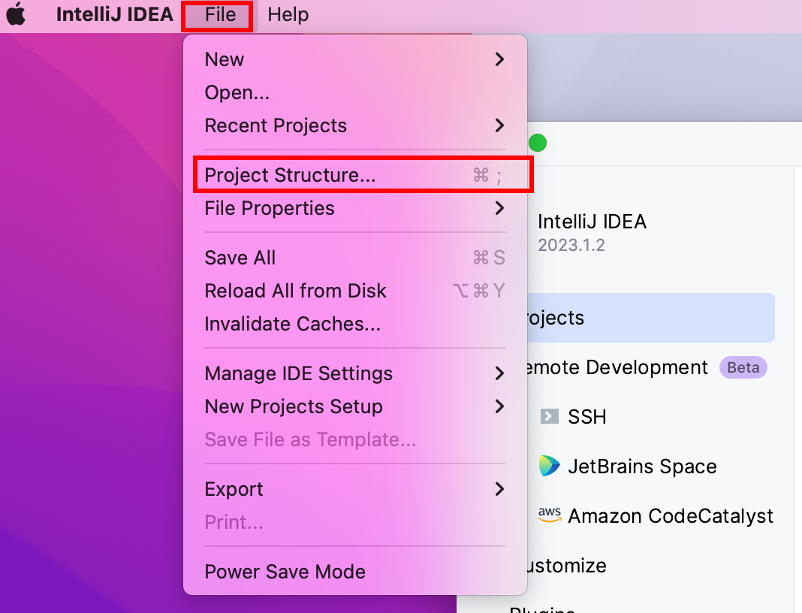
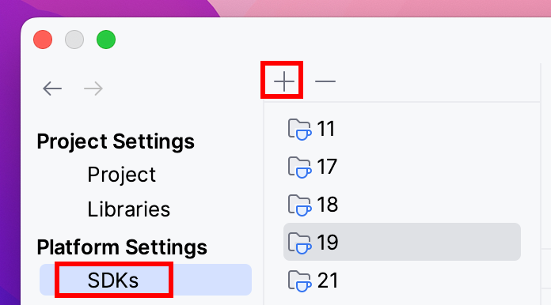
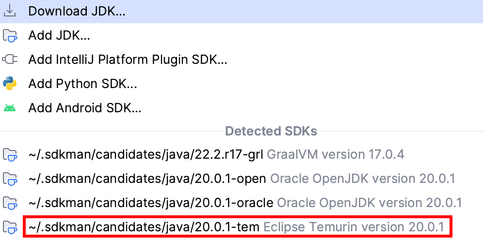
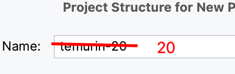

# Contributing

## Getting Started

### Prerequisites

* Clone the project from the github repository
* Ensure you have a JDK 20 installed. You can check it:
  * with Android SDK tools `sdk install java 20.0.1-tem`
  * with command line `java -version` & `javac -version`
* Check your variable environment `echo $JAVA_HOME` too.

### Start the project

1. Add JDK 20 to Intellij
   1. Open File > Project Structure

   2. Select SDKs > +

   3. Select a jdk 20 in detected SDKs

   4. Rename the chosen jdk to "20"

2. Start the backend app in dev mode with `./gradlew bootRun` or in prod mode with `./gradlew bootJar && java -jar build/libs/springboot.jar`

## Conventions

The team agrees on the following conventions:

* TDD (https://fr.wikipedia.org/wiki/Test_driven_development)
* Hexagonal architecture (https://reflectoring.io/spring-hexagonal/)
* YAGNI (https://en.wikipedia.org/wiki/You_aren't_gonna_need_it)
* 12 factor app (https://12factor.net/fr/)
* Continuous deployment or at least continuous delivery

## Code style

The team agrees to follow ktlint code style, with minor changes, specified in [.editorconfig](.editorconfig) file.

## Testing

"Unit test" means : One functionality. No it does not mean one function/class/whatever box.

If you need to unit test something in isolation, then this thing must become a submodule decoupled with an interface. It can happen for example when combinatorial is too high.

"Integration test" means : Testing an adapter with a real backing service (like a database, a queue, a http api). Docker is your friend. See TestContainers and Localstack.
"Don't mock what you don't own." These tests are slow. Beware of concurrency issues, but don't disable test parallelization.

### Domain layer

100% of the domain layer functions must be covered by unit tests.

This means more than 100% line coverage. It also means assertions cover all possible cases.

Mutation testing could be used to ensure assertions are relevant.

### Application layer

100% of the application layer functions must be covered by integration tests.

A test should verify that the application runs without additional configuration. This deserves the DevEx (Developer Experience).

### Infrastructure layer

100% of the application layer functions must be covered by integration tests.

-----

If some code is not covered, this means YAGNI and TDD have not been used. This is technical debt. There is contexts where this is acceptable, but it must be backlogged. Debt must be paid back. Interest rate is high and exponential.

## Observability

Observability kinda makes part of testing. It is a way to test in production.

The three pillars of observability are :

* Logs centralisation
* Metrology
* Distributed tracing

The team agrees to make the application observable, in order to :

* See dysfunctions before users do
* See dysfunctions before they become critical and expensive to fix
* Diagnostic dysfunctions
* Avoid babysitting the application

Warning : Auditing business data is not observability. It is a business requirement. It can be done in a backoffice and/or with event sourcing.
